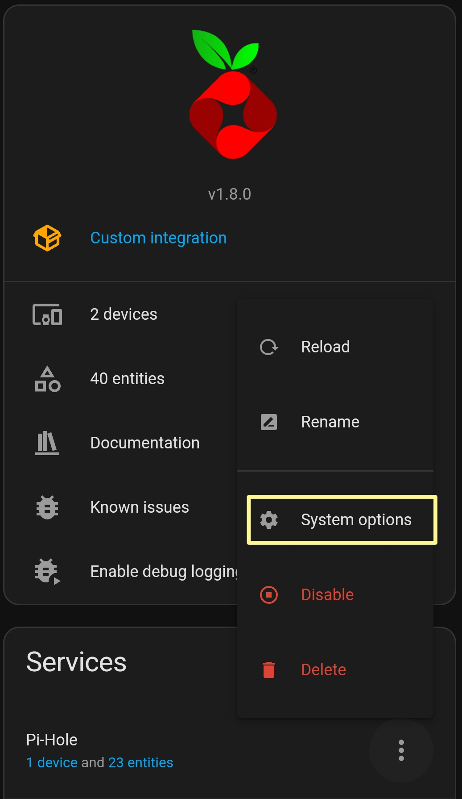
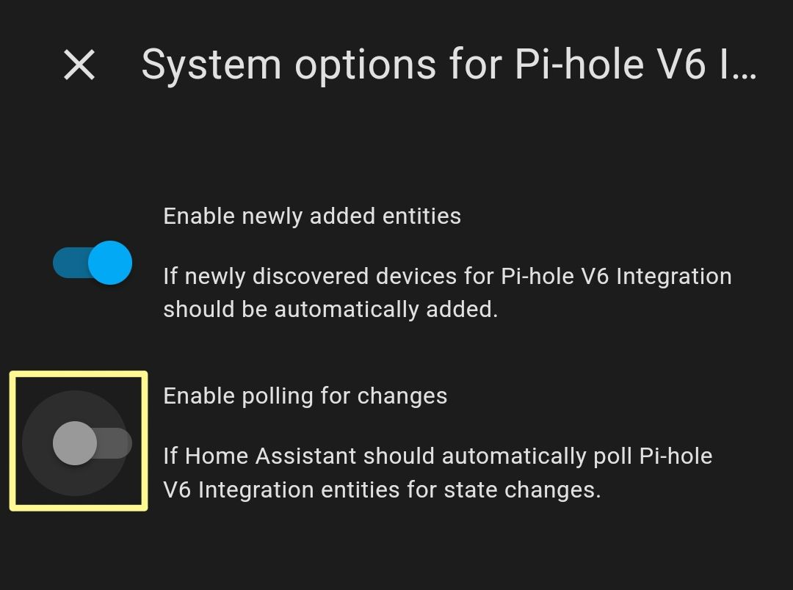

## How do I configure the refresh frequency?

### Deactivate the default refresh

In the integration page, you have to deactivate the automatic polling for the `Pi-hole V6` Integration.

#### 1. Open the system options

Click on the `System options` to open the options.



#### 2. Deactivate the automatic polling

Uncheck the option `Enable polling for changes` to deactivate the automatic polling.



### Create an Automation

#### 1. Access Settings

Open your Home Assistant interface. Click on the `Settings` icon.

#### 2. Navigate to Automations & Scenes
   
In the settings menu, select `Automations & Scenes`.

#### 3. Create a New Automation

Click on `Create automation` to start a new automation.  
Select `Create new automation` to begin the creation process.

#### 4. Access the YAML Editor

Once in the new automation, click on the `three dots` on the right side of the screen.

Select `Edit in YAML` to open the YAML editor.

#### 5. Write the YAML Code

In the YAML editor, you can now write the code to configure the refresh of your integration. Here is a basic example:

```yaml
alias: Force Pi-hole Refresh
description: "Refresh Pi-hole every minute"
triggers:
  - trigger: time_pattern
    minutes: /1
    hours: "*"
conditions: []
actions:
  - action: homeassistant.update_entity
    metadata: {}
    data:
      entity_id:
        - binary_sensor.pi_hole_status
mode: single
```

You can define the wanted frequency.

#### 6. Save and Test

After writing the code, `save` the automation then test the automation to ensure it works as expected.
