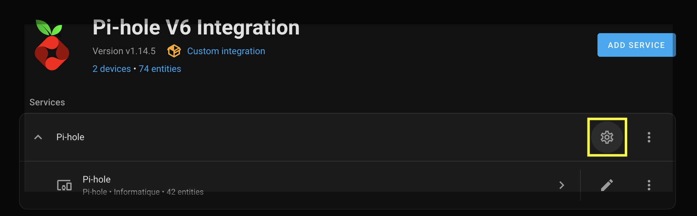
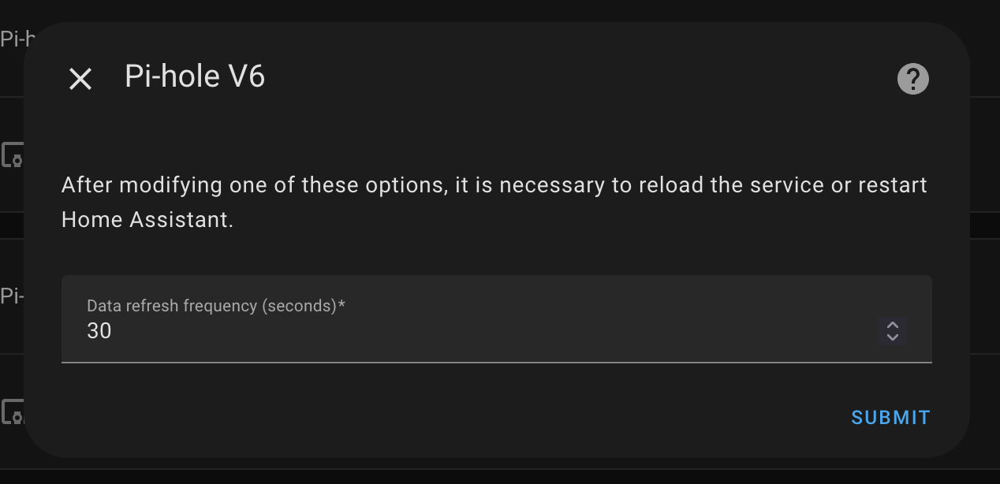
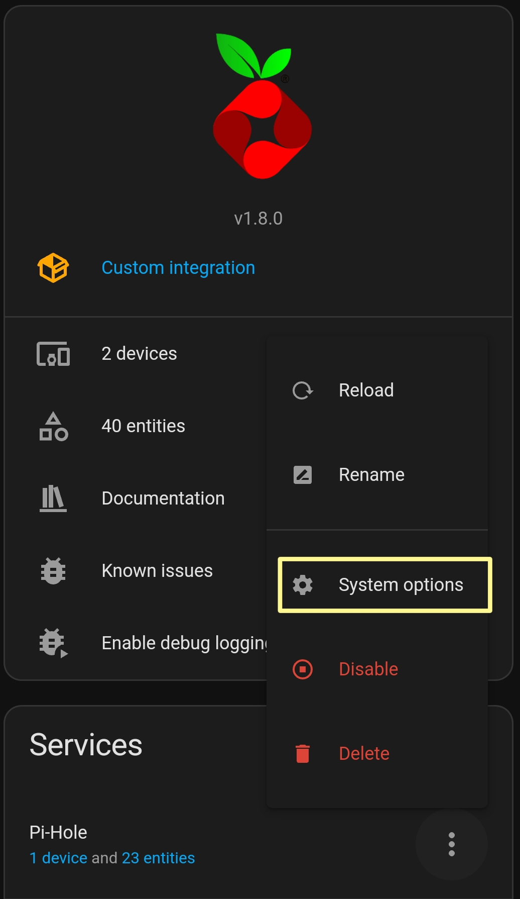
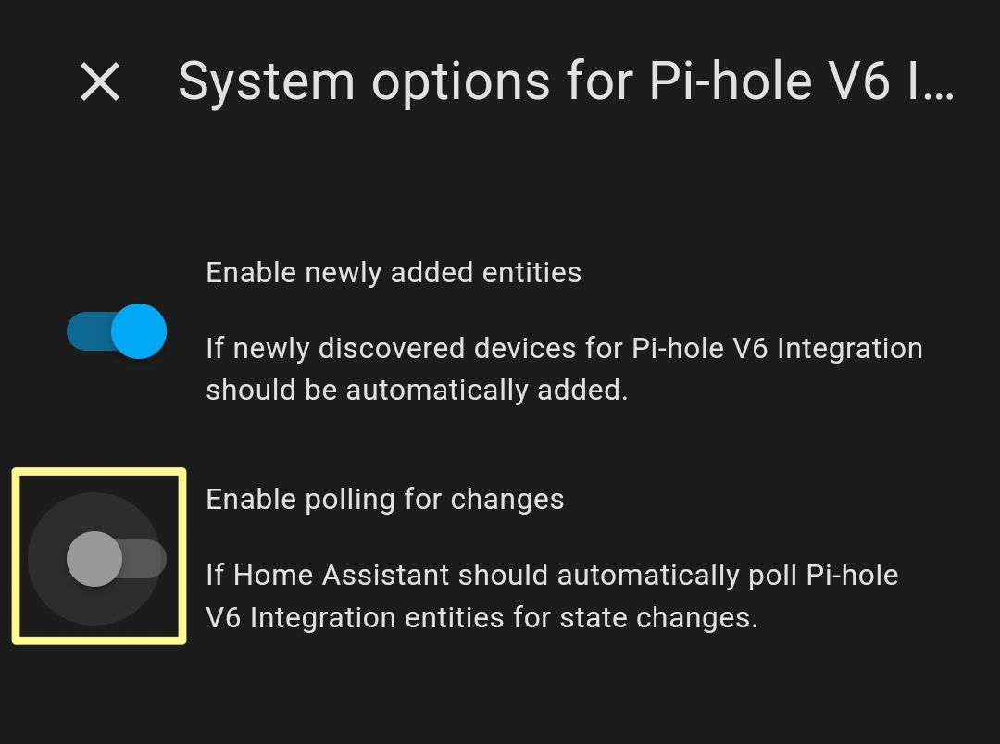

## How do I configure the refresh frequency?

### Configure the service (recommanded solution)

On the Pi-hole V6 Integration page (_/config/integrations/integration/pi_hole_v6_), configure your service.



In the pop-up window, enter the desired `Data refresh rate` value in seconds.



### The two refresh frequencies

The integration uses two independent update coordinators, so the entities that barely ever change are not
refreshed at the same pace as the live statistics. Each one has its own option:

| Option | Default | Entities refreshed | Pi-hole endpoints |
| --- | --- | --- | --- |
| `Data refresh frequency` | 300 s | All the statistics sensors (`ads_blocked_today`, `dns_queries_*`, `seen_clients`, `domains_blocked`, …), `cpu_use`, `memory_use`, `remaining_until_blocking_mode`, `latest_data_refresh`, `binary_sensor.<service>_status`, the main switch, the group switches and the four `update` entities | `summary`, `blocking_status`, `groups`, `padd` |
| `Inventory refresh frequency` | 3600 s | `configured_clients`, `dhcp_leases`, `auth_sessions`, `ftl_info_message_count` and every `device_tracker` entity | `clients`, `dhcp/leases`, `auth/sessions`, `info/messages`, `network/devices` |

The inventory frequency must be greater than or equal to the data refresh frequency. Raising it is the
recommended way to stop the network device trackers and the inventory sensors from filling the recorder
database, without slowing down the refresh of the statistics and of the blocking status.

Pressing the `Refresh data` button refreshes both coordinators at once.

### Deactivate the default refresh (alternative solution)

In the integration page, you have to deactivate the automatic polling for the `Pi-hole V6` Integration.

#### 1. Open the system options

Click on the `System options` to open the options.



#### 2. Deactivate the automatic polling

Uncheck the option `Enable polling for changes` to deactivate the automatic polling.



### Create an Automation

#### 1. Access Settings

Open your Home Assistant interface. Click on the `Settings` icon.

#### 2. Navigate to Automations & Scenes
   
In the settings menu, select `Automations & Scenes`.

#### 3. Create a New Automation

Click on `Create automation` to start a new automation.  
Select `Create new automation` to begin the creation process.

#### 4. Access the YAML Editor

Once in the new automation, click on the `three dots` on the right side of the screen.

Select `Edit in YAML` to open the YAML editor.

#### 5. Write the YAML Code

In the YAML editor, you can now write the code to configure the refresh of your integration. Here is a basic example:

```yaml
alias: Force Pi-hole Refresh
description: "Refresh Pi-hole every minute"
triggers:
  - trigger: time_pattern
    minutes: /1
    hours: "*"
conditions: []
actions:
  - action: homeassistant.update_entity
    metadata: {}
    data:
      entity_id:
        - binary_sensor.pi_hole_status
mode: single
```

You can define the wanted frequency.

#### 6. Save and Test

After writing the code, `save` the automation then test the automation to ensure it works as expected.
