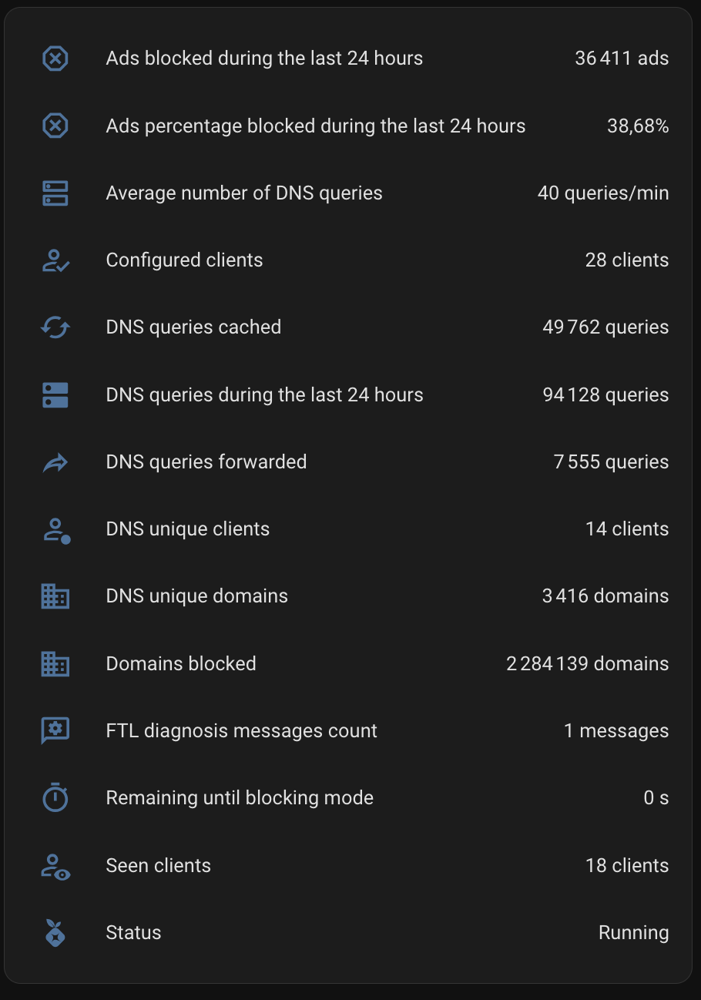
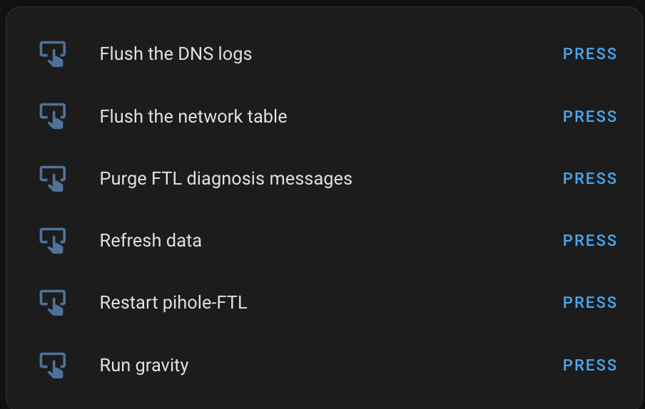
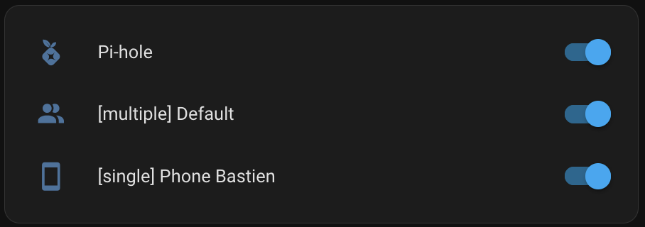
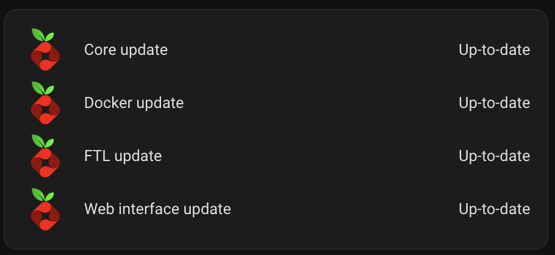
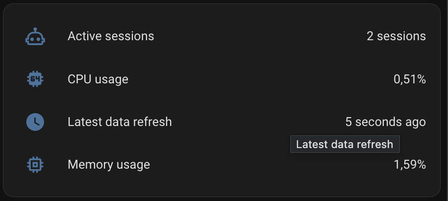
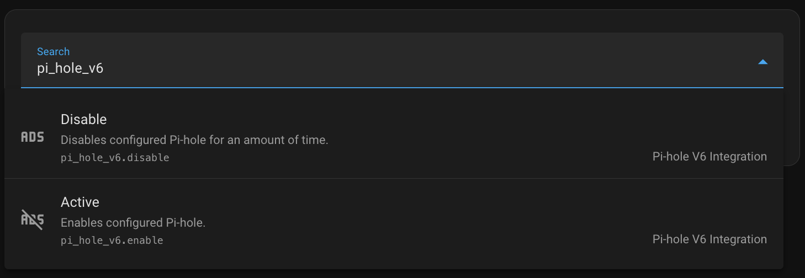

## Entities & Services

A few entities are disabled by default. You have to enable them to display / use them.  

The entities / services name is depending on the name of the service (_<service\_name>_).

### Sensors



<details>
  <summary>Display the sensors</summary>

#### -  Ads blocked during the last 24 hours

**Name:** sensor.<service\_name>_ads_blocked_today  
**Description:** Number of blocked queries during the last 24h.  
**Unit**: ads  

#### -  Ads percentage blocked during the last 24 hours

**Name:** sensor.<service\_name>_ads_percentage_blocked_today  
**Description:** Percent of blocked queries during the last 24h.  
**Unit**: percentage  

#### -  Average number of DNS queries

**Name:** sensor.<service\_name>_dns_queries_frequency  
**Description:** Average number of DNS queries per minute.  
**Unit**: queries/minute  

#### -  Configured clients

**Name:** sensor.<service\_name>_configured_clients  
**Description:** Total number of configured clients.  
**Unit**: clients  
**Attributes:**  Information about the configured clients.

```json
{
   "clients":[
      {
         "client":"192.168.31.172",
         "name":"macbook-air-bastien-m3.local",
         "comment":"Macbook Air Bastien 5Ghz",
         "groups":[
            8
         ],
         "id":7
      },
      {
         "client":"192.168.31.196",
         "name":"desktop-bastien.local",
         "comment":"MSI Desktop Bastien",
         "groups":[
            18
         ],
         "id":62
      },
      {
         "client":"192.168.31.171",
         "name":"macbook-air-bastien-m3.local",
         "comment":"Macbook Air Bastien 2.4Ghz",
         "groups":[
            8
         ],
         "id":109
      }
   ]
}
```

#### -  DNS queries cached

**Name:** sensor.<service\_name>_dns_queries_cached  
**Description:** Number of queries replied to from cache or local configuration.  
**Unit**: queries  

#### -  DNS queries during the last 24 hours

**Name:** sensor.<service\_name>_dns_queries_today  
**Description:** Total number of queries during the last 24h.  
**Unit**: queries  

#### -  DNS queries forwarded

**Name:** sensor.<service\_name>_dns_queries_forwarded  
**Description:** Number of queries that have been forwarded.  
**Unit**: queries  

#### -  DNS unique clients

**Name:** sensor.<service\_name>_dns_unique_clients  
**Description:** Number of active clients (seen in the last 24h).  
**Unit**: clients  

#### -  DNS unique domains

**Name:** sensor.<service\_name>_dns_unique_domains  
**Description:** Number of unique domains FTL knows.  
**Unit**: domains  

#### -  Domains blocked

**Name:** sensor.<service\_name>_domains_blocked  
**Description:** Number of domain on your Pi-hole's gravity.  
**Unit**: domains  

#### -  FTL diagnosis messages count

**Name:** sensor.<service\_name>_ftl_info_message_count  
**Description:** Total number of Pi-hole diagnosis messages.  
**Unit**: messages  
**Attributes:**  Information about the FTL diagnosis messages.  

```json
{
   "messages":[
      {
         "id":4161,
         "timestamp":1754172958,
         "type":"LIST",
         "plain":"List with ID 2 (https://mirror1.malwaredomains.com/files/justdomains) was inaccessible during last gravity run"
      }
   ],
   "status":"OK: Messages fetched successfull",
}
```

#### -  Remaining until blocking mode

**Name:** sensor.<service\_name>_remaining_until_blocking_mode  
**Description:** Remaining seconds until blocking mode is automatically changed.  
**Unit**: seconds  

#### -  Seen clients

**Name:** sensor.<service\_name>_seen_clients  
**Description:** Total number of clients seen by FTL.  
**Unit**: clients  

#### -  Status

**Name:** binary_sensor.<service\_name>_status  
**Description:** Blocking status  
**Attributes:**  Information about the Pi-hole instance.

```json
{
  "URL instance": "http://pihole.local:8088/admin",
  "Core version": "v6.1.4",
  "Docker version": "2025.07.1",
  "FTL version": "v6.2.3",
  "Web interface version": "v6.2.1"
```  

</details>

### Actions via buttons

Please refer to the Pi-hole documentation to understand the meaning of each of these actions.



<details>
  <summary>Display the actions via buttons</summary>

#### -  Flush the DNS logs

**Name:** button.<service\_name>_action_flush_logs  

#### -  Flush the network table

**Name:** button.<service\_name>_action_flush_arp  

#### -  Purge FTL diagnosis messages

**Name:** button.<service\_name>_action_ftl_purge_diagnosis_messages  

#### -  Refresh data

**Name:** button.<service\_name>_action_refresh_data  
**Description:** Action to force the refresh of Pi-hole information in Home Assistant.

#### -  Restart pihole-FTL

**Name:** button.<service\_name>_action_restartdns  

#### -  Run gravity

**Name:** button.<service\_name>_action_gravity  

> [!NOTE]  
> The '**Permit destructive actions via API**' option must be enabled in the Pi-hole options to perform the following actions:
> - `Flush the network table`
> - `Flush the DNS logs`
> - `Restart pihole-FTL` 

</details>

### Switches



<details>
  <summary>Display the switches</summary>

#### - Global switch

**Name:** switch.<service\_name>  
**Description:** Switch to active or disable the ads blocking at Pi-hole instance level.

The switch name is depending on the name of the service. 

#### - Group switch (one switch per group)

A new switch is created for each group in order to control it specifically.
The switches name is depending on the name of the group.  

**Name:** switch.<service\_name>\_group\_<group_name>  
**Description:** Switch to active or disable the ads blocking at group level.  
**Attributes:** Information about the group, as well as the list of clients associated with the group.

```json
{
  "info": {
    "name": "[single] Phone Bastien",
    "id": 14,
    "comment": null
  },
  "clients": [
    {
      "client": "192.168.31.189",
      "id": 72,
      "name": "phone-bastien.local"
    }
  ],
}
```

</details>

### Updates



<details>
  <summary>Display the updates</summary>

#### - Core update

**Name:** update.<service\_name>_core_update_available 

#### - Docker update

**Name:** update.<service\_name>_docker_update_available

#### - FTL update

**Name:** update.<service\_name>_ftl_update_available

#### - Web Interface update

**Name:** update.<service\_name>_web_update_available

</details>

### Diagnostic Sensors



<details>
  <summary>Display the diagnostic sensors</summary>

#### - Active sessions

**Name:** sensor.<service\_name>_auth_sessions  
**Description:** Total number of auth sessions.  
**Unit**: sessions  
**Attributes:** Information about the active sessions. 

```json
{
   "sessions":[
      {
         "id":0,
         "current_session":true,
         "valid":true,
         "login_at":1754179116,
         "last_active":1754179117,
         "valid_until":1754180917,
         "remote_addr":"172.19.0.1",
         "user_agent":"HomeAssistant/2025.7.4 aiohttp/3.12.14 Python/3.13",
         "app":false,
         "cli":false
      }
   ]
}
```

#### - CPU usage

**Name:** sensor.<service\_name>_cpu_use   
**Description:** Amount of processing power utilized by the Pi-hole instance.  
**Unit**: percentage  
**Attributes:** Information about the CPU usage. 

```json
{
   "nprocs":4,
   "%cpu":39.6721305847168,
   "load":{
      "raw":[
         1.29833984375,
         0.95849609375,
         0.767578125
      ],
      "percent":[
         32.45849609375,
         23.96240234375,
         19.189453125
      ]
   }
}
```

#### - Latest data refresh

**Name:** sensor.<service\_name>_latest_data_refresh   
**Description:** Last data update from the Pi-hole API.  
**Unit**: date

#### - Memory usage

**Name:** sensor.<service\_name>_memory_use   
**Description:** Amount of memory utilized by the Pi-hole instance.  
**Unit**: percentage  
**Attributes:** Information about the memory usage. 

```json
{
   "ram":{
      "total":7962996,
      "free":192828,
      "used":4743964,
      "available":2837180,
      "%used":59.57511469301253
   },
   "swap":{
      "total":999420,
      "free":930556,
      "used":68864,
      "%used":6.89039642992936
   }
}
```

</details>

### Services



<details>
  <summary>Display the services</summary>

#### -  Disable blocking

**Name:** pi_hole_v6.disable  
**Description:** Disables configured Pi-hole for an amount of time.  
**Action:**  

```yaml
action: pi_hole_v6.disable
data:
  duration: "00:05:15"
target:
  entity_id:
    - switch.<service\_name>_group_single_xiaomi_mipad_6
```

> [!NOTE]  
> The duration is optional.  
Temporary deactivation of blocking works with the global switch (via native Pi-hole feature) or group switches (via Pi-hole V6 Integration).

#### -  Enable blocking

**Name:** pi_hole_v6.enable  
**Description:** Enables configured Pi-hole.  
**Action:**  

```yaml
action: pi_hole_v6.enable
target:
  entity_id:
    - switch.pi_hole
    - switch.<service\_name>_group_single_xiaomi_mi_tv_box
data: {}
```

</details>
