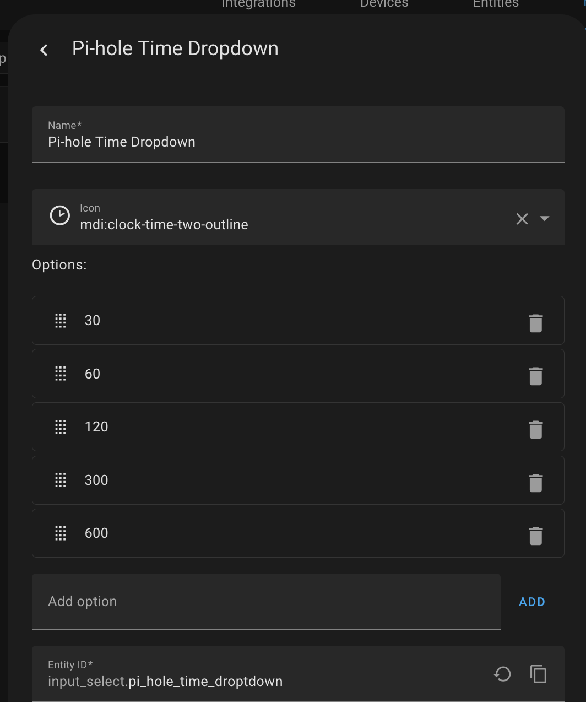
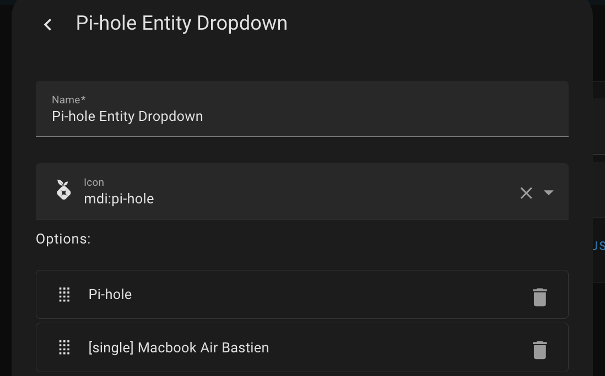
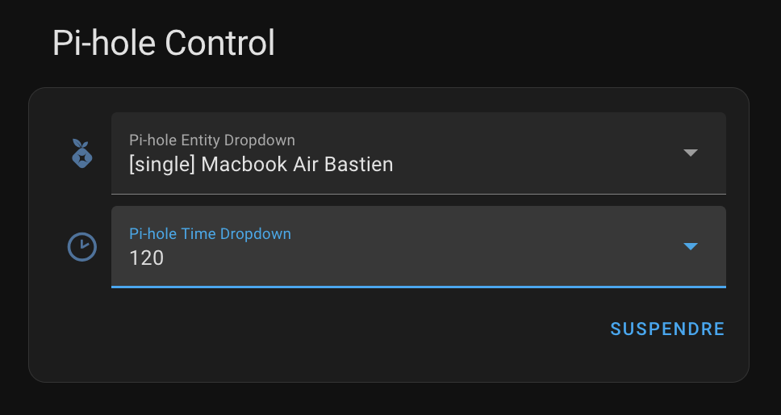
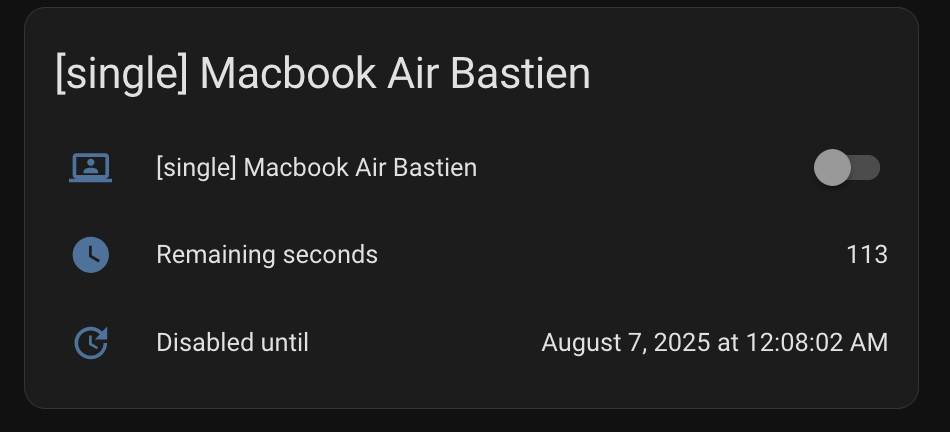

# A Pi-hole Control Card

A handy dashboard card for easy management of your Pi-hole.

## Prerequisites

In this example, you have to consider that there are two switches.

The first switch serves as the master control to disable ad blocking across all devices.

- **name:** Pi-hole
- **entity_id:** switch.pi_hole

The second switch is a group switch to disable ad blocking on all my MacBooks."

- **name:** [single] Macbook Air Bastien
- **entity_id:** switch.pi_hole_group_single_macbook_air_bastien

Before creating your dashboard card, ensure you have two dropdown menus and a script ready.

### Dropdown deactivating delays

First, we create a dropdown menu for selecting deactivation delays.



The dropdown entity_id is: `input_select.pi_hole_entity_dropdown`.

### Dropdown entity names

Next, we create a dropdown menu for a selecting Pi-hole group (switch) to deactivate.



The dropdown entity_id is: `input_select.pi_hole_entity_dropdown`.

### The script

Next, we will create a script to execute the service that allows disabling the blocking.

```yaml
sequence:
  - variables:
      duration: >
        {{ states.input_select.pi_hole_time_droptdown.state | int |
        timestamp_custom('%H:%M:%S', False) }}
      pihole_entity: >
        {{ states.switch | selectattr('attributes.friendly_name', 'eq',
        states.input_select.pi_hole_entity_dropdown.state | string) |
        map(attribute='entity_id') | list | first }}
  - action: pi_hole_v6.disable
    target:
      entity_id:
        - "{{ pihole_entity }}"
    data:
      duration: "{{ duration }}"
alias: Pi-hole - Switch status OFF (generic)
icon: mdi:pi-hole
mode: single
description: ""
```

The script entity_id is: `script.pi_hole_switch_status_off_generic`

## Pi-hole Control Card creation

Now, we will combine the dropdowns, the script, and an entities card.

The Pi-hole control system consists of two parts. The first part allows you to deactivate blocking after selecting a group."



A second part which will be displayed only if the ads blocking is deactivated.



The second part will only be displayed if the ad blocking is deactivated.

The code is available bellow:

```yaml
type: vertical-stack
cards:
  - type: entities
    entities:
      - entity: input_select.pi_hole_entity_dropdown
        name: Pi-hole entity
      - entity: input_select.pi_hole_time_droptdown
        name: Disable time (in seconds)
      - entity: script.pi_hole_switch_status_off_generic
        name: " "
        icon: " "
        action_name: SUSPENDRE
  - type: conditional
    conditions:
      - condition: state
        entity: switch.pi_hole
        state: "off"
    card:
      type: entities
      entities:
        - entity: switch.pi_hole
        - type: attribute
          entity: switch.pi_hole
          attribute: remaining_seconds
          name: Remaining seconds
          icon: mdi:clock
        - type: attribute
          entity: switch.pi_hole
          attribute: until_date
          name: Disabled until
          icon: mdi:update
      title: Pi-hole
      show_header_toggle: false
  - type: conditional
    conditions:
      - condition: state
        entity: switch.pi_hole_group_single_macbook_air_bastien
        state: "off"
    card:
      type: entities
      entities:
        - entity: switch.pi_hole_group_single_macbook_air_bastien
        - type: attribute
          entity: switch.pi_hole_group_single_macbook_air_bastien
          attribute: remaining_seconds
          name: Remaining seconds
          icon: mdi:clock
        - type: attribute
          entity: switch.pi_hole_group_single_macbook_air_bastien
          attribute: until_date
          name: Disabled until
          icon: mdi:update
      title: "[single] Macbook Air Bastien"
      show_header_toggle: false
```

Feel free to modify this to suit your needs and share your implementations with the community!
